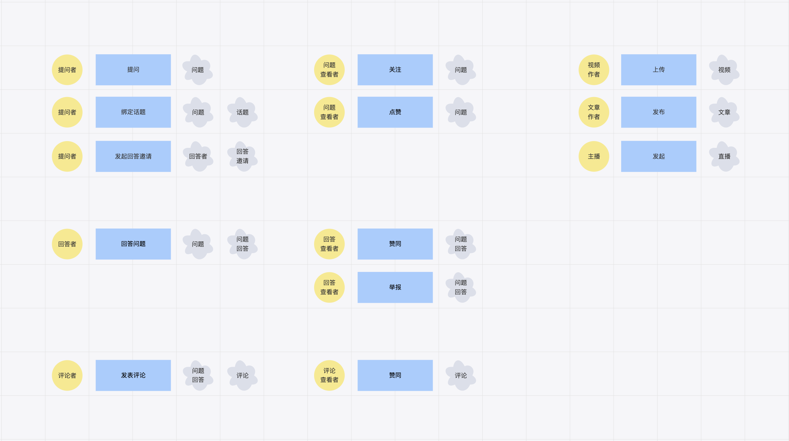

## 回顾一下
主体（Subject）是行为的实施者，客体（Object）是行为的承受者。
- 在一个行为中，主客体必然存在。
- 主体或者客体可以嵌套存在。
- 一个实体不能在同一个行为中，既是主体也是客体。

PS：
如果是在描述一个行为，其实更喜欢操作者（主体），被操作者（客体）这样的描述，但认同用主体和客体来描述有其他的理由，后面会提到。

## 试着分析下业务
首先我们就得先找到行为。对于各个业务行为，都可以找到对应的业务主体。将这些业务主体归纳起来，就可以定位核心业务主体。

举一个逛知乎的🌰：天气冷了，想吃糖炒🌰，到知乎查一查挑选🌰有什么讲究。假装我们已经来了一场知乎之旅。

🌰炒完了，现在让我们思考下，业务主体是谁？用户么？好像太宽泛了，使用系统的都是用户。 
“用户”其实是业务主体的最大泛化，我们需要把“用户”这个概念具像化起来，待分析的业务主体是不同角色的“用户”。

现在，我们就找到了一系列业务主体（其实还没有找全，这里只是做个示例）：
- 提问者
- 回答者
- 评论者
- 问题查看者
- 回答查看者
- 评论查看者
- 视频作者
- 文章作者
- 主播
- 。。。

PS：
中文的复杂语义让主谓宾的结构不那么明显，如果用英语表示就很容易看出来了
“提问者对问题绑定话题”
"The questioner binds the question to the topic"

## 如何找到核心域
这里就可以提一个有意思的词“生意”
- 软件是构建在“生意”之上的
- 和谁“做生意”就是业务主体
- “生意”就是我们的核心域

上面我们找到了业务主体，但究竟哪些是核心业务主体，这需要我们进一步分析。定义出要做的生意是什么，要和谁做生意。

**核心以外，皆为辅助。**

对于业务分析来说，我们就定义出了核心业务和辅助业务，可以以此为依据进行核心业务的聚焦，辅助业务的删减。

但如此多的行为，如何删减？可以试试断电法。
将一切归于现实世界的操作，那么哪些业务是可以被精简掉的？
对于需要精简掉的业务，对应的部门就可以考虑裁人了，好像过于真实了。
这也牵扯到另一套主客体体系，在软件内部的主客体，比如：推荐功能的主体可以看作“导购员”，问答数据获取功能的主体可以看作“仓库管理员”，这里就不展开多讲了。

## 但，换个角度试试
当我们创造了一个概念的时候，同时也会被这个概念束缚。
为什么对主客体的解释只能在一个行为中？或者说行为仍是一个抽象，那这个抽象的维度是否可以改变下？

对于业务分析来说，行为固然重要，但行为本身只是一个流程。
可否将整个系统的存在，或者说系统状态的维护看作一个行为，系统启动即行为开始，系统终止即行为结束。
那么在这个持续不断的行为中，主体应当是位于中心的资源，其他资源服务于中心资源。
就上面的例子而言，问答应当位于中心，其他的一切都是为了问答服务。
推荐是为了使问答以推的形式被发现。
搜索是为了使问答以拉的形式被定位。
而绑定话题，关注，点赞等扩展了问答的固有内容，使得更精确被推荐/搜索到。

当然，古早的简单知乎的定位可能是围绕着问答，现在的知乎有专栏，有圆桌，有直播，更倾向于含义更宽的“内容”，毕竟已经有了一个创作中心，创作者成为了一个更统一的角色。
还有一些依然服务于问答，也可以服务于其他业务主体，其实就是一个支撑级的公共服务。

从这个角度看，一个系统中业务主体可以存在多个，有大有小，取决于投入和关注度的不同。市场总是变化的，业务主体也有自己的演进更替，赚的多一点就大一些，赚不到钱就小一些，甚至逐步退化掉。

值得提醒的是，注意力是有限度的，对一个系统的注意力也是这样，考虑到注意力投入，维护成本等，一个系统的业务主体不应过多。
一个是高度聚焦，两个是并行尝试，三个可能就是都来试试，四个五个？？？为啥不拆成多个系统？或者是平台集成？

## 点回标题
以模型来规约业务，好像一直没有讲到模型。但实际上我们一直都在使用模型，模型是对对象、人或系统的信息表示，用简单的信息结构代表整体，规避杂糅在一起的复杂信息混合，一种典型的关注点分离。

无论是上面哪种业务主体的分析方式，我们都创造了一种形式化的方式表述业务。
业务需求的失控往往来源于业务需求是通过自然语言来描述的，一个点子就可以成为一个需求。
自然语言是很难进行逻辑分析和约束的，我们用主客体建模的思想，就是转换业务需求的自然语言到可被分析的形式化语言。而约束，是将需求的识别和评估前置，聚焦核心，将收益最大化。

